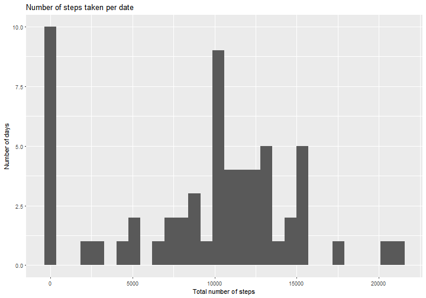
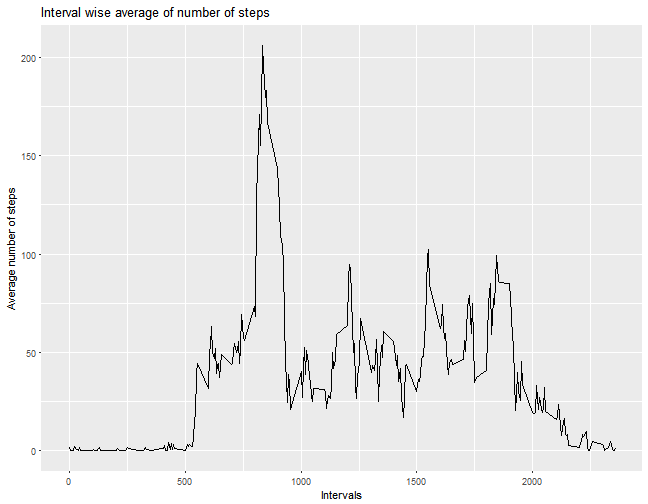
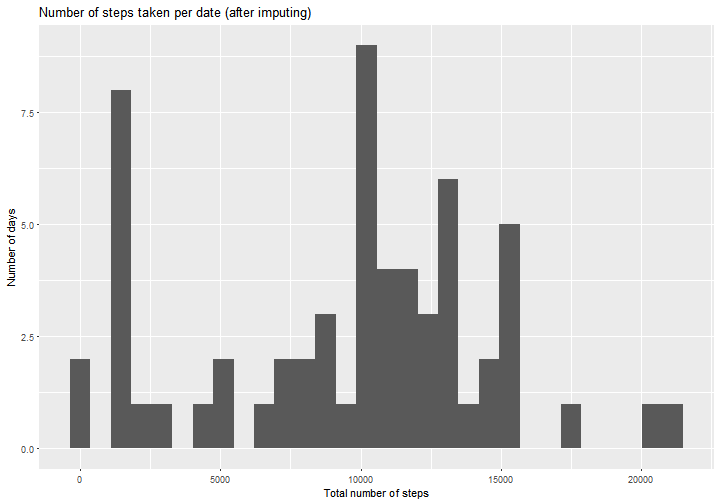
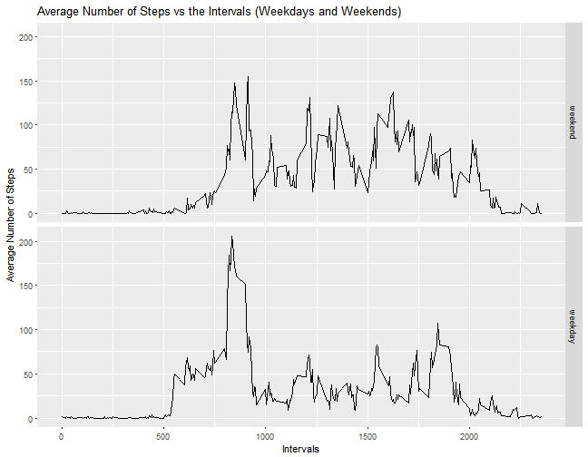

Load the csv file into R 

```r
library(dplyr)
activity <- read.csv("activity.csv")
str(activity)
```

```
## 'data.frame':	17568 obs. of  3 variables:
##  $ steps   : int  NA NA NA NA NA NA NA NA NA NA ...
##  $ date    : Factor w/ 61 levels "2012-10-01","2012-10-02",..: 1 1 1 1 1 1 1 1 1 1 ...
##  $ interval: int  0 5 10 15 20 25 30 35 40 45 ...
```

Change date field to date type

```r
date <- as.Date(activity$date)
```

###Question 1 : What is mean total number of steps taken per day?

1. Calculate the total number of steps per day


```r
group <- group_by(activity, date)
total <- summarize(group, sum(steps, na.rm=TRUE))
head(total)
```

```
## # A tibble: 6 x 2
##         date `sum(steps, na.rm = TRUE)`
##       <fctr>                      <int>
## 1 2012-10-01                          0
## 2 2012-10-02                        126
## 3 2012-10-03                      11352
## 4 2012-10-04                      12116
## 5 2012-10-05                      13294
## 6 2012-10-06                      15420
```

2. Make a histogram of the total number of steps taken each day


```r
library(ggplot2)
total <- as.data.frame(total)
names(total) <- c("date", "steps")
ggplot(total, aes(total$steps)) + geom_histogram() + labs(title="Number of steps taken per date") + xlab("Total number of steps") + ylab("Number of days")
```

```
## `stat_bin()` using `bins = 30`. Pick better value with `binwidth`.
```



3. Calculate and report the mean and median of the total number of steps taken per day


```r
stepsmean <- mean(total$steps)
stepsmedian <- median(total$steps)
```

The mean of the total number of steps per day is 9354.2295082.
The median of the total number of steps is 10395

###Question 2 : What is the average daily activity pattern?
1. Make a time series plot (i.e. type = "l") of the 5-minute interval (x-axis) and the average number of steps taken, averaged across all days (y-axis)

```r
group1 <- group_by(activity, interval)
mean <- summarize(group1, stepsMean=mean(steps, na.rm=TRUE))
ggplot(mean, aes(mean$interval, mean$stepsMean)) + geom_line() + labs(title="Interval wise average of number of steps") +xlab("Intervals") +ylab("Average number of steps")
```



2. Which 5-minute interval, on average across all the days in the dataset, contains the maximum number of steps?


```r
head(arrange(mean, desc(stepsMean)),1)
```

```
## # A tibble: 1 x 2
##   interval stepsMean
##      <int>     <dbl>
## 1      835  206.1698
```

### Question 3 : Imputing missing values
1. Calculate and report the total number of missing values in the dataset (i.e. the total number of rows with NAs)

```r
sum(!complete.cases(activity))
```

```
## [1] 2304
```

2. Devise a strategy for filling in all of the missing values in the dataset. The strategy does not need to be sophisticated. For example, you could use the mean/median for that day, or the mean for that 5-minute interval, etc.

Replace the NAs with the mean of the steps count for the 5 minute interval.


```r
colnames <- unique(activity$interval)
df <- activity[FALSE,]

for (i in colnames) {
    f <- filter(activity, interval==i)
    m <- median(f$steps, na.rm=TRUE)
    if (is.nan(m)) {
        m <- 0
    }
    f[is.na(f)] <- m
    df <- rbind(df,f)
}
```

3. Create a new dataset that is equal to the original dataset but with the missing data filled in.

df is the new dataset with NAs filled in.


```r
head(df)
```

```
##   steps       date interval
## 1     0 2012-10-01        0
## 2     0 2012-10-02        0
## 3     0 2012-10-03        0
## 4    47 2012-10-04        0
## 5     0 2012-10-05        0
## 6     0 2012-10-06        0
```

```r
sum(is.na(df))
```

```
## [1] 0
```

4. Make a histogram of the total number of steps taken each day and Calculate and report the mean and median total number of steps taken per day. Do these values differ from the estimates from the first part of the assignment? What is the impact of imputing missing data on the estimates of the total daily number of steps?

Plot the same histogram with the new data frame df.


```r
group <- group_by(df, date)
total <- summarize(group, sum(steps, na.rm=TRUE))
total <- as.data.frame(total)
names(total) <- c("date", "steps")
ggplot(total, aes(total$steps)) + geom_histogram() + labs(title="Number of steps taken per date (after imputing)") + xlab("Total number of steps") + ylab("Number of days")
```

```
## `stat_bin()` using `bins = 30`. Pick better value with `binwidth`.
```



No significant impact after imputing missing values.

###Question 4 : Are there differences in activity patterns between weekdays and weekends?

1. Create a new factor variable in the dataset with two levels - "weekday" and "weekend" indicating whether a given date is a weekday or weekend day.


```r
df$date <- as.Date(df$date)
weekdays <- c('Monday', 'Tuesday', 'Wednesday', 'Thursday', 'Friday')
df$weekday <- factor((weekdays(df$date) %in% weekdays), 
                   levels=c(FALSE, TRUE), labels=c('weekend', 'weekday')) 
head(df)
```

```
##   steps       date interval weekday
## 1     0 2012-10-01        0 weekday
## 2     0 2012-10-02        0 weekday
## 3     0 2012-10-03        0 weekday
## 4    47 2012-10-04        0 weekday
## 5     0 2012-10-05        0 weekday
## 6     0 2012-10-06        0 weekend
```

2. Make a panel plot containing a time series plot (i.e. type = "l") of the 5-minute interval (x-axis) and the average number of steps taken, averaged across all weekday days or weekend days (y-axis). See the README file in the GitHub repository to see an example of what this plot should look like using simulated data.


```r
group4 <- group_by(df, weekday, interval)
plotdata <- as.data.frame(summarize(group4, mean(steps)))
names(plotdata) <- c("weekday", "interval", "mean")
ggplot(plotdata, aes(plotdata$interval, plotdata$mean)) + geom_line() + facet_grid(weekday ~.) + labs(title="Average Number of Steps vs the Intervals (Weekdays and Weekends)") + xlab("Intervals") + ylab("Average Number of Steps")
```




